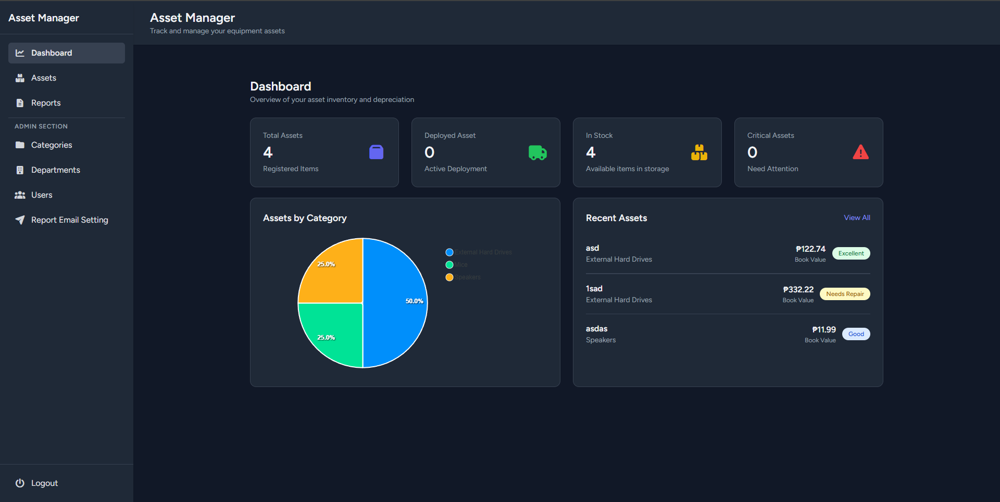

# Asset Management System 🏢

[](https://laravel.com/)
[](https://vuejs.org/)
[](https://tailwindcss.com/)
[](https://apexcharts.com/)
[](https://axios-http.com/)
[](https://pinia.vuejs.org/)
[](https://laravel.com/docs/sanctum)
[](LICENSE)

---

## Project Description

**Asset Management System** is a modern web application with **Laravel API backend** and **Vue.js frontend**.  
It allows organizations to efficiently track and manage assets across their lifecycle. The system includes:

- Asset deployment tracking
- Depreciation and lifecycle reporting
- Inventory summaries
- Automated weekly email notifications
- Role-based access control

The frontend is powered by **Vue.js**, using **Axios** for API calls, **Pinia** for state management, and **Tailwind CSS** for responsive UI. Interactive charts are built with **ApexCharts**, providing clear insights for better decision-making.

---

## Screenshot

<p align="center">
  
</p>

---

## Features

- Track organizational assets throughout their lifecycle
- Automatic depreciation and lifecycle reports
- Inventory summaries for better visibility
- Automated weekly email notifications
- Role-based access control with Laravel Sanctum
- Modern, responsive design with Vue.js and Tailwind CSS
- Interactive charts with ApexCharts
- API-driven architecture with Laravel backend and Vue.js frontend

---

## Installation

### Backend (Laravel API)

1. **Clone the repository**

```bash
git clone https://github.com/wilfredo-domanico-jr/AssetManager.git
cd AssetManager/backend
```

2. **Install PHP dependencies**

```bash
composer install
```

3. **Set up environment variables**

```bash
cp .env.example .env
php artisan key:generate
```

4. **Set up the database**

```bash
php artisan migrate
php artisan db:seed
```

4. **Set up the database**

```bash
php artisan migrate
php artisan db:seed
```

5. **Serve the API**

```bash
php artisan serve
```

### Frontend (Vue.js)

1. **Navigate to frontend folder**

```bash
cd ../frontend
```

2. **Install Node dependencies**

```bash
npm install
```

3. **Run the development server**

```bash
npm run dev
```

3. **Open the app in your browser**

```
Typically at http://localhost:5173 (Vite default port)
```

---

## Usage

1. Access the frontend in your browser.
2. Log in or register as a user.
3. Manage assets, view reports, and track lifecycle data.
4. Interact with charts and receive notifications.

---

## Technologies & Libraries

- **Backend** – Laravel, MySQL, Laravel Sanctum
- **Frontend** – Vue.js, Tailwind CSS, Pinia, Axios
- **Charts** – ApexCharts
- **Other** – PHP 8+, Composer, Node.js, NPM/Vite

---

## License

This project is licensed under the [MIT License](LICENSE).
